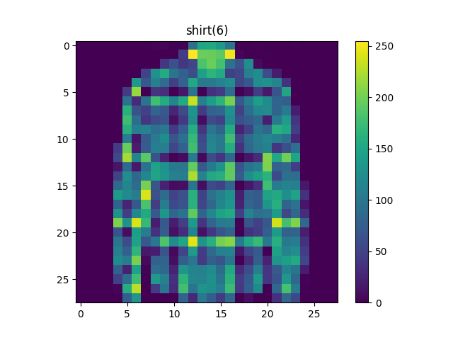
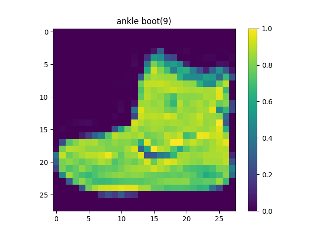
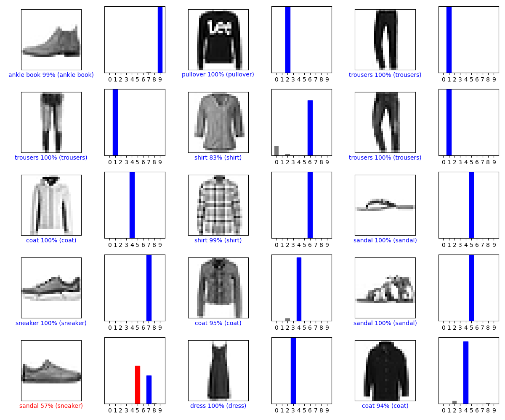

This blog is going to cover the [basic image classifciation tutorial](https://www.tensorflow.org/tutorials/keras/classification) provided by Tensorflow. For this blog you will need to install the following dependencies via `pip3`.

* Tensorflow
* Numpy
* Matplotlib

\

First things first, I am going to make a class that will contain the functionality to make it easier for me to reference down the road.

```Python
class BasicImageClassifier(object):
    def __init__(self):
        self.classes = ['t-shirt', 'trousers', 'pullover', 'dress', 'coat', 'sandal', 'shirt', 'sneaker', 'bag', 'ankle boot']
        (self.train_imgs, self.train_labels), (self.test_imgs, self.test_labels) = self.obtain_data()
```

Normally I would put the functionality of getting the data it's own method called `obtain_data`, but since keras provides a nice `load_data` function for the [fashion MNIST dataset](https://keras.io/api/datasets/fashion_mnist/), there is no need. Hard coding `self.classes` is also not ideal, but since there is only 10 I am not bothered. A better way would be storing the classes in a text file and retrieving them.

\

The first method we are going to add is `explore_data`, where we explore things like the number of values we are working with and the shape of those values. Along with that I like that the tutorial also shows a way to visualize one of the values with a heatmap, so we will put that in this method.

```Python
    def explore_data(self):
        print(f'\nTraining image shape: {self.train_imgs.shape}')
        print(f'{len(self.train_imgs)} training images')
        print(f'Labels: {self.train_labels}\n')
        print(f'Training images type: {type(self.train_imgs)}')
        
        print(f'\nTesting image shape: {self.test_imgs.shape}')
        print(f'{len(self.test_imgs)} test images')
        print(f'Labels: {self.test_labels}')

        # Visualize a training image
        plt.figure()
        plt.title(f'{self.classess[self.train_labels[0]]}({self.train_labels[0]})')
        plt.imshow(self.train_imgs[0])
        plt.colorbar()
        plt.grid(False)
        plt.show()

        # Visualize a test image
        plt.figure()
        plt.title(f'{self.classess[self.test_labels[7]]}({self.test_labels[7]})')
        plt.imshow(self.test_imgs[7])
        plt.colorbar()
        plt.grid(False)
        plt.show() 
```

The output:

```
Training image shape: (60000, 28, 28)
60000 training images
Labels: [9 0 0 ... 3 0 5]


Testing image shape: (10000, 28, 28)
10000 test images
Labels: [9 2 1 ... 8 1 5]
```




\

The second method we are going to add is `preprocess_data`, which is going to be the functionality for preparing the data. 

```Python
    def preprocess_data(self):
        self.train_imgs = self.train_imgs / 255
        self.test_imgs = self.test_imgs / 255

        plt.figure(figsize=(10, 10))
        for i in range(50):
            plt.subplot(5, 5, i+1)
            plt.xticks([])
            plt.yticks([])
            plt.grid(False)
            plt.imshow(self.train_imgs[i], cmap=plt.cm.binary)
            plt.xlabel(self.classes[self.train_labels[i]])
        plt.show()
```

There isn't much functionality in this method, but I think it is worth exploring what exactly is happening in this step. Before the `preprocess_data` step, the images are multi-dimensional arrays consisting of pixel values with a range of `[0, 255]`. When we do the `self.train_imgs = self.train_imgs / 255` operation, we then transform every pixel value of the images from a `[0, 255]` range to a range of `[0, 1]`. This is a process called [(image processing) normalization](https://en.wikipedia.org/wiki/Normalization_%28image_processing%29). Without normalization, "inputs with large integer values can disrupt or slow down the learning process." [[source]](https://machinelearningmastery.com/how-to-manually-scale-image-pixel-data-for-deep-learning/) To get a different perspective let's compare the ankle boot image from above with a normalized one.

**Pre-normalization**


**Post-normalization**



Pretty neat stuff.

\

The third method we are going to add is `build_model`, which you may have guessed, builds the model. 

```Python
    def build_model(self):

    model = keras.Sequential([
            keras.layers.Flatten(input_shape=(28, 28)),
            keras.layers.Dense(128, activation='relu'),
            keras.layers.Dense(10)
        ])

    model.compile(
        optimizer='adam',
        loss=keras.losses.SparseCategoricalCrossentropy(from_logits=True),
        metrics=['accuracy']
    )

    return model
```

Now again not much going on, but another place where it's worth exploring what exactly is happening. The first layer takes images in the form of a two-dimensional array (28x28 pixels) and transforms them into a one-dimensional array (28*28 = 784 pixels). The second layer is a [fully connected](https://en.wikipedia.org/wiki/Convolutional_neural_network#Fully_connected) layer with 128 neurons, that uses the [relu](https://en.wikipedia.org/wiki/Rectifier_(neural_networks)) activation function. ReLU is a pretty simple activation function to understand. If the input value is 0.0 or less then return 0.0, otherwise return the input value. The last layer is another fully connected layer that consists of 10 neurons, one for each possible class, which returns a logits value. Logits is a "vector of raw (non-normalized) predictions that a classification model generates, which is ordinarily then passed to a normalization function." [[source]](https://developers.google.com/machine-learning/glossary/#logits)

The `model.compile` operation is for configuring the model with [metrics](https://keras.io/api/metrics/) in order to determine the performance of the model. This model is using the [adam](https://machinelearningmastery.com/adam-optimization-algorithm-for-deep-learning/) optimizer, which is an extension of the [stochastic gradient descent](https://en.wikipedia.org/wiki/Stochastic_gradient_descent) (SGD) method. Adam "is designed to combine the advantages of two recently popular methods: AdaGrad (Duchi et al., 2011), which works well with sparse gradients, and RMSProp (Tieleman & Hinton, 2012), which works well in on-line and non-stationary settings..." [[source]](https://arxiv.org/pdf/1412.6980.pdf) For more on adam, refer to the [Adam: A method for stochastic optimization](https://arxiv.org/pdf/1412.6980.pdf) paper. 

The next option used with `model.compile` is `loss`, and in this case we are using `SparseCategoricalCrossentropy`. Let's break this down bit by bit. `Sparse` (in this instance), refers to using a single integer from zero to the number of classes minus one, instead of a dense one-hot encoding of the class label. An example (for a 3 class problem) would be `sparse`: `{0, 1, 2, 3}` and `one-hot encoding`: `{[1,0,0], [0,1,0], [0,0,1]}`. `Categorical` means that the variable "is one that has two or more categories, but there is no intrinsic ordering to the categories." [[source]](https://stats.idre.ucla.edu/other/mult-pkg/whatstat/what-is-the-difference-between-categorical-ordinal-and-numerical-variables/) `Cross entropy` "is a measure of the difference between two probability distributions for a given random variable or set of events." [[source]](https://machinelearningmastery.com/cross-entropy-for-machine-learning/)

\ 

With the model built and the data ready, it's time for the fourth method: `train_model`. In this step we are going to feed the training data (training images and labels) to the model. We pass `self.train_imgs` for the x argument, `self.train_labels` for the y argument, and `10` for the number of epochs to the `fit` method. Then we invoke the `evaluate` method which returns the loss and metrics value for the model.

The output:

```
Epoch 1/10
60000/60000 [==============================] - 3s 54us/sample - loss: 0.5045 - acc: 0.8242
Epoch 2/10
60000/60000 [==============================] - 3s 52us/sample - loss: 0.3777 - acc: 0.8633
Epoch 3/10
60000/60000 [==============================] - 3s 50us/sample - loss: 0.3399 - acc: 0.8776
Epoch 4/10
60000/60000 [==============================] - 3s 50us/sample - loss: 0.3156 - acc: 0.8850
Epoch 5/10
60000/60000 [==============================] - 3s 52us/sample - loss: 0.2971 - acc: 0.8896
Epoch 6/10
60000/60000 [==============================] - 3s 49us/sample - loss: 0.2826 - acc: 0.8954
Epoch 7/10
60000/60000 [==============================] - 3s 50us/sample - loss: 0.2679 - acc: 0.9012
Epoch 8/10
60000/60000 [==============================] - 3s 49us/sample - loss: 0.2586 - acc: 0.9041
Epoch 9/10
60000/60000 [==============================] - 3s 49us/sample - loss: 0.2493 - acc: 0.9068
Epoch 10/10
60000/60000 [==============================] - 3s 52us/sample - loss: 0.2403 - acc: 0.9102
10000/10000 - 0s - loss: 0.3458 - acc: 0.8771

Test loss: 0.3458002413749695
Test accuracy: 0.8770999908447266
```

\

With the model trained, it's time to add the fifth method: `make_prediction`.

```Python
    def plot_img(self, prediction, actual_label, img):
        plt.grid(False)
        plt.xticks([])
        plt.yticks([])

        plt.imshow(img, cmap=plt.cm.binary)

        predicted_label = np.argmax(prediction)
        if predicted_label == actual_label:
            color = 'blue'
        else:
            color = 'red'

        predicted_class = self.class_names[predicted_label]
        confidence = 100*np.max(prediction)
        actual_class = self.class_names[actual_label]

        plt.xlabel(f'{predicted_class} {confidence :2.0f}% ({actual_class})', color=color)

    def plot_predictions(self, prediction, actual_label):
        plt.grid(False)
        plt.xticks(range(10))
        plt.yticks([])
        thisplot = plt.bar(range(10), prediction, color="#777777")
        plt.ylim([0, 1])
        predicted_label = np.argmax(prediction)

        thisplot[predicted_label].set_color('red')
        thisplot[actual_label].set_color('blue')


    def make_predictions(self):
        probability_model = keras.Sequential([
            self.model,
            keras.layers.Softmax()
        ])

        predictions = probability_model.predict(self.test_imgs)

        num_rows = 5
        num_cols = 3
        num_images = num_rows*num_cols
        plt.figure(figsize=(2*2*num_cols, 2*num_rows))
        for i in range(num_images):
            plt.subplot(num_rows, 2*num_cols, 2*i+1)
            prediction, actual_label, img = predictions[i], self.test_labels[i], self.test_imgs[i]
            self.plot_img(prediction, actual_label, img)
            plt.subplot(num_rows, 2*num_cols, 2*i+2)
            self.plot_predictions(prediction, actual_label)
        plt.tight_layout()
        plt.show()
```

The `make_predictions` method is accompanied by two helper functions: `plot_img` and `plot_predictions`. First, let's go through what the `make_predictions` method is doing. We start by creating a new model with the trained model as the first layer, and softmax for the second layer. Softmax is mathematical function that "turns arbitrary real values into probabilities" [[source]](https://victorzhou.com/blog/softmax) We feed the logits value that is returned from our trained model and feed it into the softmax layer, which then transforms the logits vector into probabilities. I found that [victor zhou](https://victorzhou.com/) has a really good blog which explains [softmax](https://victorzhou.com/blog/softmax) if you want to learn more about it.

The next thing that happens is we get a `predictions` value via the `predict` method, passing the test images. If we take a look at the first prediction made in `predictions` we see the following.

```
[1.8137916e-10 6.0670822e-14 2.0957621e-12 1.5968125e-12 8.8443645e-12
 4.5295115e-04 1.0622513e-11 2.3051950e-03 1.6443106e-09 9.9724185e-01]
```

Each value is a confidence of the model that the given image is the corresponding class. To get the highest confidence we can do `np.argmax(predictions[0])`, which will result (for this case) `9`. This means the model is the most confident that the image was an ankle boot, which if we compare to `self.test_labels[0]`, we see that the model was correct.

The `make_predictions` is accompanied by two additional methods: `plot_img` and `plot_predictions`. The `plot_img` method plots the given image, checks if the `predicted_label` is the same as the `actual_label`, then sets the `plt.xlabel` value to the `predicted_class`/`confidence`/`actual_label`. The `plot_predictions` method plots each value of the given `prediction`, making the `actual_label` bar blue and the `predicted_label` bar red (if the `predicted_label` is the `actual_label` only a blue bar will be visible).

The output:



\

That's it for this tutorial. I encourage you to find a piece of clothing online or take a picture of one and test the model out on it!